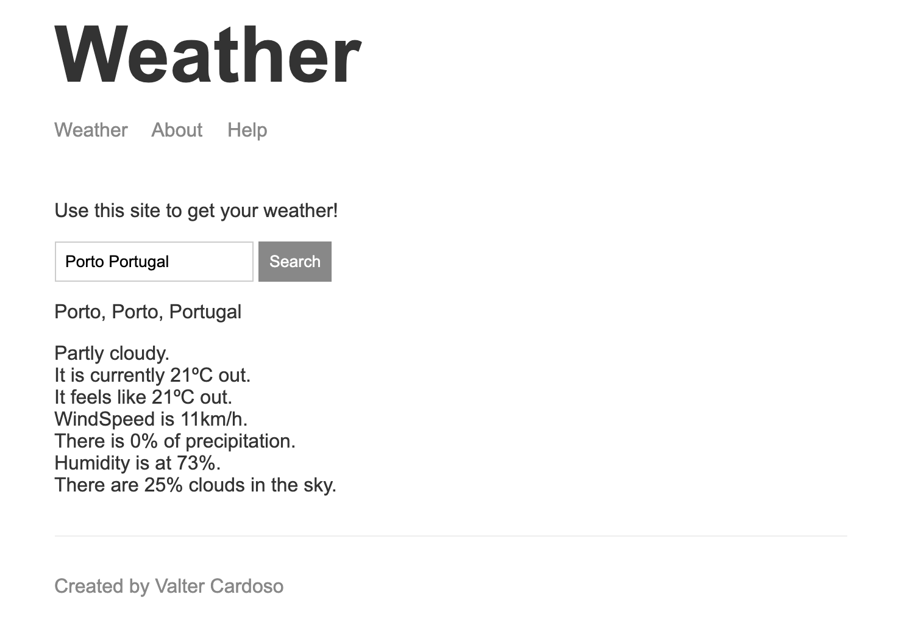

# Weather App using NodeJs and HandleBars

This is a study of Node.Js programming language, implementing HandleBars for generating *html* in the backend

---

### Features
- Uses advanced ***JavaScript*** language.
- Uses Node.Js ***npm*** packages.
- Uses ***express*** framework.
- Uses ***handlebars*** framework for generating *html* files.
- Uses ***mongoDB*** as a local database.

---

### Thanks and Credits
The fun of this study was made possible by:
- [Node.js Complete course](https://www.udemy.com/course/the-complete-nodejs-developer-course-2/) in [Udemy](https://www.udemy.com/)
- [Node.js](https://nodejs.org/en/) Official Site
- [npm](https://www.npmjs.com) Official Site
- [handlebarsjs](https://handlebarsjs.com/) Official Site
- Andrew Mead [GitHub](https://github.com/andrewjmead/node-course-v3-code) Repository and [Site](https://mead.io/)
- All credits from this study goes to *Udemy* and the instructor *Andrew Mead*
